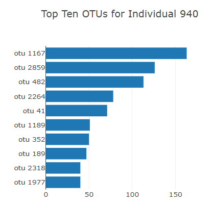

# BellyButtonDashboard
## Purpose:
    For the most part, the microbes in your navel are harmless. In fact, recent studies suggest that bacteria on your body may strengthen your skin's defense system, but if you never clean your belly button, they'll grow unencumbered, and that can be a problem. Therefore, this project has been analyzied so that volunteers should be able to identify the top 10 bacterial species in their belly buttons, from the data provided to us.
    Below is how the dashboard looks like.

## Results:
   - Interactive dashboard created with drop down for ID. so if an Id is selected corresponding data will be displayed.

   - Next an horizontal chart showing us top 10 bacterial spiecies with respect to the Id selected.

   - A bubble chart was also created showing us bacterial cultures per sample.

   - Lastly, we created a gauge chart that displays the weekly washing frequency's value, and display the value as a measure from 0-10 on the progress bar in the gauge chart when an individual ID is selected from the dropdown menu.

## Summary:
   It was interesting to create such dashboard. Dashboards are very useful for visual representation of your data.
